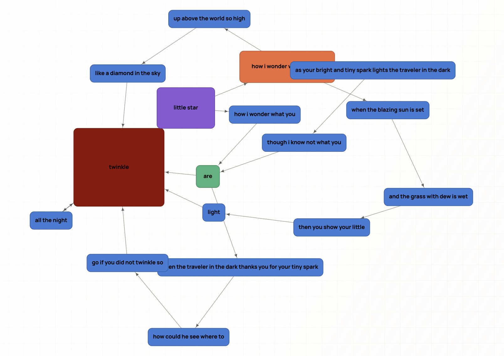

# DryLyrics

DryLyrics is a fun project for visualizing song lyrics as a phrase graph.

- Phrases are represented as nodes.
- Directed edges represent flow direction between phrases.
- The more a phrase repeats, the larger its size and the hotter its color.

